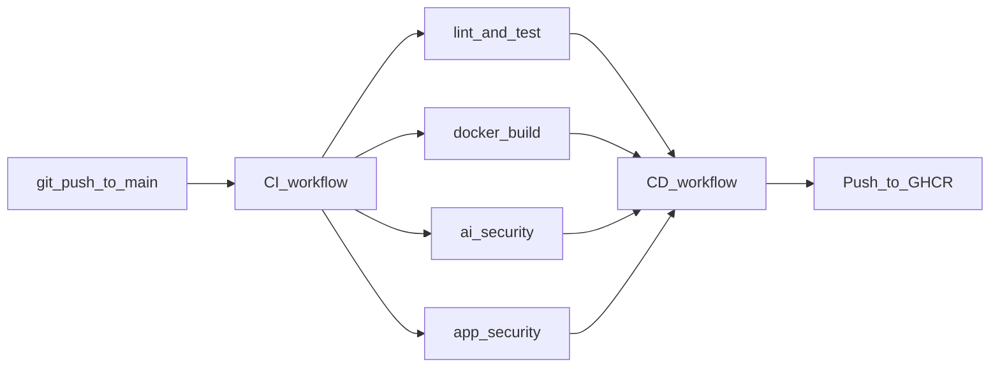

# Small LLM + DevOps Learning Project

A minimal learning project: wrap a tiny Hugging Face model (`distilgpt2`) in a FastAPI API, containerize it with Docker, and validate everything with GitHub Actions CI/CD.

## What you get

- `POST /generate` — text generation from a prompt
- `GET /health` — health check for deploy platforms
- Docker image for consistent local and cloud runs
- CI pipeline: lint → test → Docker build → security scans
- CD pipeline: push Docker image to GitHub Container Registry after CI passes

## Prerequisites

- Python 3.11 or 3.12 (recommended; Docker and CI use 3.11)
- Docker Desktop (for container runs)
- GitHub account (for CI/CD)

## Phase 1 — Run locally (no Docker)

```bash
# Use Python 3.11 or 3.12 (py launcher on Windows)
py -3.12 -m venv .venv

# Windows PowerShell
.venv\Scripts\Activate.ps1

pip install -r requirements.txt
uvicorn app.main:app --reload
```

Open http://127.0.0.1:8000/docs for the interactive API docs.

Example request:

```bash
curl -X POST http://127.0.0.1:8000/generate ^
  -H "Content-Type: application/json" ^
  -d "{\"prompt\": \"Hello, my name is\"}"
```

On first run, `distilgpt2` downloads from Hugging Face (~80MB) and caches locally.

## Phase 2 — Run with Docker

Docker Desktop must be running on your machine.

```bash
docker build -t llm-api .
docker run -p 8000:8000 llm-api
```

The model downloads on first container start (cached in the container filesystem).

Test:

```bash
curl http://localhost:8000/health
```

## Activate the DevOps pipeline (one-time setup)

The pipeline files are ready in [`.github/workflows/`](.github/workflows/). Follow these steps to turn them on.

### Step 1 — Create a GitHub repository

1. Go to [github.com/new](https://github.com/new)
2. Name it `LLMmodelcreation` (or any name you like)
3. Leave it **empty** — no README, no `.gitignore`
4. Click **Create repository**

### Step 2 — Initialize git and push

In PowerShell, from the project folder:

```powershell
cd c:\Users\149836\LLMmodelcreation
git init
git branch -M main
git add .
git commit -m "Add small LLM API with CI/CD pipeline"
git remote add origin https://github.com/YOUR_USERNAME/LLMmodelcreation.git
git push -u origin main
```

Replace `YOUR_USERNAME` with your GitHub username.

### Step 3 — Watch the pipeline run

1. Open your repo on GitHub
2. Click the **Actions** tab
3. You should see two workflows:

| Workflow | When it runs | What it does |
|----------|--------------|--------------|
| **CI** | Every push/PR to `main` | Lint → test → Docker build → **AI model security** → app security |
| **CD** | After CI succeeds on `main` | Build image → push to GHCR |

### Step 4 — View your published Docker image

After CD succeeds:

1. Go to your GitHub profile → **Packages**
2. Or: repo → **Packages** (right sidebar)
3. Image name: `ghcr.io/your-username/llmmodelcreation:latest`

To make the package public (optional): Package → **Package settings** → **Change visibility**.

### Pipeline flow



## Phase 3 — CI pipeline

Push this repo to GitHub. The workflow in [`.github/workflows/ci.yml`](.github/workflows/ci.yml) runs on every push/PR to `main`:

1. **Lint** — `ruff check`
2. **Test** — `pytest` (model is mocked in tests)
3. **Docker build** — verifies the image builds
4. **AI model security** — ModelScan, PickleScan, OWASP AIBOM (see below)
5. **App security** — `pip-audit`, `gitleaks`, and `trivy` container scan

Run tests locally:

```bash
pip install -r requirements.txt
ruff check app tests
pytest tests/ -v
```

## Phase 4 — CD pipeline (automatic)

The workflow in [`.github/workflows/cd.yml`](.github/workflows/cd.yml) runs **after CI passes** on `main`:

1. Builds the Docker image
2. Pushes to **GitHub Container Registry** (`ghcr.io`)
3. Tags with `latest` and `sha-<commit>`

Pull and run anywhere:

```bash
docker pull ghcr.io/YOUR_USERNAME/llmmodelcreation:latest
docker run -p 8000:8000 ghcr.io/YOUR_USERNAME/llmmodelcreation:latest
```

## Phase 5 — Deploy to the cloud (live URL)

Pick **one** platform below. Both can deploy from your GitHub repo or from the GHCR image.

### Option A: Railway (recommended for beginners)

1. Push this repo to GitHub.
2. Go to [railway.app](https://railway.app) and create a new project.
3. Choose **Deploy from GitHub repo** and select your repository.
4. Railway detects the `Dockerfile` automatically.
5. Set the public port to **8000** if prompted.
6. After deploy, open the generated URL and test:

   ```bash
   curl -X POST https://YOUR-APP.up.railway.app/generate \
     -H "Content-Type: application/json" \
     -d '{"prompt": "Hello"}'
   ```

**Note:** First request may be slow while the model downloads inside the container.

### Option B: Render

1. Push this repo to GitHub.
2. Go to [render.com](https://render.com) → **New** → **Web Service**.
3. Connect your GitHub repo.
4. Set:
   - **Environment:** Docker
   - **Port:** 8000
5. Create the service and wait for the build to finish.
6. Test the public URL the same way as Railway above.

### Option C: Pull from GHCR on any server

If CD has already published your image, run it on any machine with Docker:

```bash
docker pull ghcr.io/YOUR_USERNAME/llmmodelcreation:latest
docker run -p 8000:8000 ghcr.io/YOUR_USERNAME/llmmodelcreation:latest
```

## AI model security (DevSecOps for ML)

The `ai-security` job scans the **Hugging Face model** your app uses (`distilgpt2` from [`app/model.py`](app/model.py)), not just the Python application.

| Tool | What it checks | Why it matters |
|------|----------------|----------------|
| **ModelScan** | Pickle, H5, SavedModel files for unsafe code | Detects model serialization attacks before deploy |
| **PickleScan** | Python pickle opcodes in model weights | `distilgpt2` uses PyTorch pickle format — common attack vector |
| **OWASP AIBOM Generator** | Model metadata → CycloneDX JSON | AI Bill of Materials: provenance, lineage, compliance |

Reports are uploaded as CI artifacts (`ai-security-reports`).

### Run AI scans locally

```powershell
cd c:\Users\149836\LLMmodelcreation
.venv\Scripts\Activate.ps1
pip install -r requirements.txt -r requirements-ai-security.txt

# ModelScan + PickleScan
python scripts/ai_security_scan.py

# AIBOM (requires Git Bash or WSL on Windows)
bash scripts/generate_aibom.sh
```

Output lands in `reports/`:
- `modelscan.json` — serialization scan results
- `aibom-distilgpt2.json` — CycloneDX AIBOM

If you change the model in `app/model.py`, CI automatically scans the new model ID.

## Phase 6 — App security (included in CI)

The `app-security` job in [`.github/workflows/ci.yml`](.github/workflows/ci.yml) runs:

| Scan | Tool | Purpose |
|------|------|---------|
| Dependencies | `pip-audit` | Known vulnerabilities in Python packages |
| Secrets | `gitleaks` | Accidental API keys or tokens in commits |
| Container | `trivy` | Critical/high CVEs in the Docker image |

Extend later with Snyk (you already have the VS Code extension) or SBOM tools like `syft`.

## Optional: use your own fine-tuned model

After a Kaggle fine-tune experiment, push weights to Hugging Face Hub and change `MODEL_NAME` in [`app/model.py`](app/model.py). Rebuild the Docker image and redeploy — that is the full MLOps loop in miniature.

## Project layout

```
app/
  main.py       # FastAPI routes
  model.py      # Hugging Face model loading
scripts/
  ai_security_scan.py   # ModelScan + PickleScan
  generate_aibom.sh     # OWASP AIBOM (CycloneDX)
tests/
  test_api.py   # API smoke tests (mocked model)
Dockerfile
requirements.txt
requirements-ai-security.txt
.github/workflows/ci.yml
.github/workflows/cd.yml
```

## Learning path summary

| Phase | Focus | Done when |
|-------|-------|-----------|
| 1 | Local API | `/generate` returns JSON |
| 2 | Docker | Container serves on port 8000 |
| 3 | CI | Green GitHub Actions check |
| 4 | CD | Image in GHCR |
| 5 | Cloud deploy | Public URL responds |
| 6 | App DevSecOps | pip-audit, gitleaks, trivy pass |
| 7 | AI DevSecOps | ModelScan, PickleScan, AIBOM in CI |
